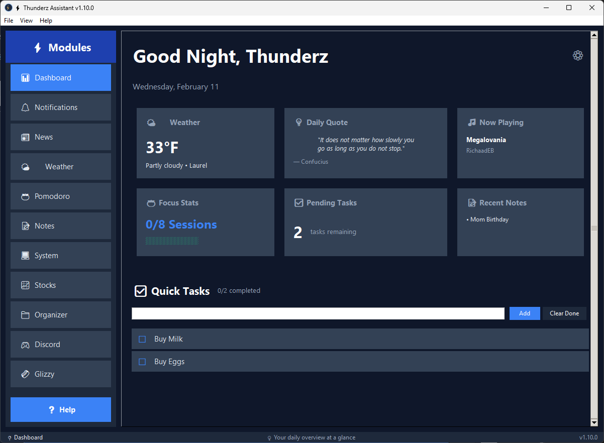
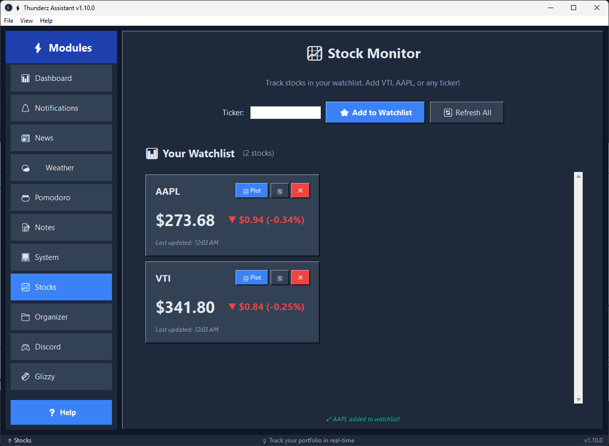
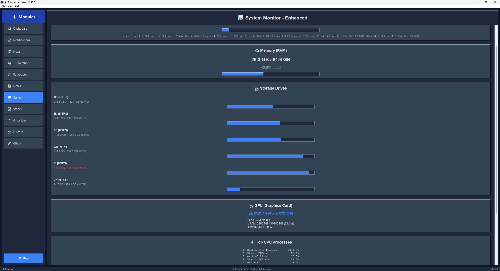
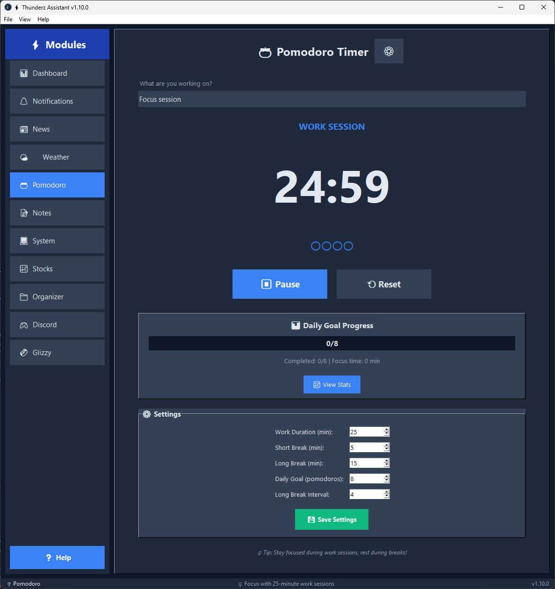
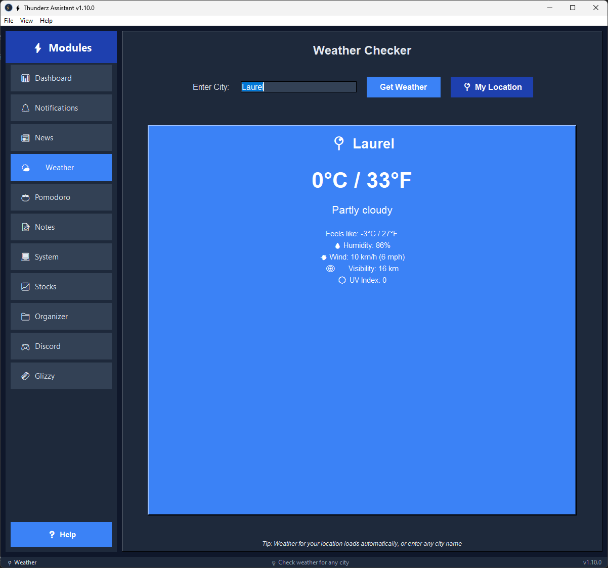
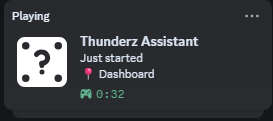

# ⚡ Thunderz Assistant

A modular, productivity-focused GUI application built with Python. Your Swiss Army knife for daily tasks, system monitoring, note-taking, and workflow optimization!


---

## 🎯 Current Version: **1.12.5**

### ⚔️ What's New in v1.12.5? — FF14 Module Overhaul
- **🛠️ Settings Tab**: Manage your BIS consumables list (food & potions) with XIVAPI item lookup. Exact-name search fixes resolution of items like "Grade 4 Gemdraught of Mind".
- **👥 Static Tab Dropdowns**: Inline food/potion/gear set dropdowns per member card (populated from Settings), with ✕ clear buttons.
- **🧮 Batch Craft Calculator**: Enter how many Extract you have → calculator reads the potion recipe and distributes crafts proportionally across your static's potion mix, showing crafts + potions per type live.
- **📍 Vendor & Gathering Locations**: Materials in the Crafting tab now show colored zone chips — amber for vendor locations, green for gathering zones.
- **🎯 Final Items Clarity**: Crafting lists from Static tab show exact consumable quantities (e.g., `×150 Grade 4 Gemdraught of Dexterity`) in the Final Items panel.
- **🔗 Loot Tab Roster Sync**: Loot Tracker now reads its roster from the Static tab's member list automatically.
- **🐛 Vendor zone fix**: Fixed a silent SQLite `UPDATE` failure that prevented vendor/gathering zone data from being saved for recipe-only items.

### 🎨 Previous: v1.12.4
- **🔍 Command Palette (Ctrl+K)**: Instantly search modules, notes, and stocks.
- **🎨 Theming System**: Switch between Dark Blue, OLED Black, and Slate themes.
- **🔔 Stock Price Alerts**: Get notified when a watched stock hits your target.
- **📤 Notes Export**: Export notes as `.md`, `.txt`, or a `.zip` archive.
- **⚡ Focus Mode (F11)**: Distraction-free borderless fullscreen.
- **🔎 Sidebar Search**: Live filter sidebar modules by name.
- **📋 Clipboard Manager**: Persistent 50-item clipboard history module.
- **₿ Crypto Widget**: Live BTC/ETH/SOL prices on the Dashboard.
- **📅 Pomodoro Heatmap**: GitHub-style yearly contribution heatmap.

---

## 📸 Screenshots

| Dashboard | Stock Monitor |
|-----------|--------------|
|  |  |

| System Monitor | Pomodoro |
|----------------|----------|
|  |  |

| Weather | Discord Rich Presence |
|---------|-----------------------|
|  |  |

---

## ⌨️ Keyboard Shortcuts

Maximize efficiency with these global hotkeys:

| Shortcut | Action |
|----------|--------|
| **Ctrl+1** | Jump to Dashboard |
| **Ctrl+2** | Jump to News |
| **Ctrl+3** | Jump to Weather |
| **Ctrl+4** | Jump to Notes |
| **Ctrl+5** | Jump to module 5 |
| **Ctrl+6** | Jump to module 6 |
| **Ctrl+7** | Jump to module 7 |
| **Ctrl+8** | Jump to module 8 |
| **Ctrl+9** | Jump to module 9 |
| **Ctrl+K** | Open command palette (search modules, notes, stocks) |
| **F5** | Refresh current module |
| **F11** | Toggle Focus Mode (hide sidebar) |
| **Ctrl+Q** | Quit application |

💡 **Tip:** Hover over any sidebar button for helpful tooltips!

---

## ✨ Features

### 📊 Dashboard (Home Screen)
Your fully customizable daily command center:
- ⚙️ **Widget System**: Enable/disable and reorder widgets via Settings.
- ⏰ **Live Clock**: Time-based greetings with your custom username.
- 🌤️ **Weather & Quotes**: Auto-updating info cards.
- 🎵 **Now Playing**: Live Spotify status tracking (Windows).
- 🍅 **Focus Stats**: Track your daily Pomodoro progress at a glance.
- 📝 **Recent Notes**: Quick access to your latest ideas.
- ✅ **Quick Tasks**: Persistent to-do list for immediate goals.

### 📝 Quick Notes
Lightweight, markdown-ready notebook:
- ✨ **Rich Text**: Headers (#), lists (-), bold (**), and italic (*) rendering.
- 🏷️ **Organize**: Filter by Category (Work, Personal, Ideas) or Tags.
- 📌 **Pinning**: Keep important notes at the top.
- 🔍 **Instant Search**: Real-time filtering by title or content.
- 💾 **Auto-save**: Notes are saved instantly to JSON.

### 🍅 Pomodoro Timer (v2)
Advanced focus system for deep work:
- ⏱️ **Customizable**: Set your own Work, Short Break, and Long Break durations.
- 🏷️ **Task Labeling**: Track exactly what you worked on during each session.
- 📊 **Visual Stats**: View bar charts of your focus time (Last 7/30 days).
- 🎯 **Daily Goals**: Set session targets and track progress visually.
- 🔔 **Notifications**: Sound alerts and system tray notifications on completion.

### 🔔 Notification Center
Centralized hub for all app alerts:
- 🔴 **Unified History**: View alerts from all modules in one place.
- 🔢 **Badges**: Red counter on sidebar for unread items.
- 🎨 **Types**: distinct styles for Info, Success, Warning, and Error.
- 🔕 **Do Not Disturb**: Mute notifications when focusing.

### 📈 Stock Monitor
Real-time market tracking:
- 💼 **Watchlist**: Track unlimited stocks, ETFs, and Crypto.
- 📊 **Live Data**: Real-time prices, daily change, and % gain/loss.
- 📉 **Charts**: Interactive historical charts (1D, 1W, 1M, 1Y, 5Y).
- 🔄 **Smart Refresh**: Threaded background updates to keep UI smooth.

### 💻 System Monitor
Keep an eye on your hardware:
- 🔥 **CPU**: Total load + per-core breakdown.
- 🧠 **RAM**: Real-time usage with progress bars.
- 💾 **Storage**: Monitor all connected drives.
- 🎮 **GPU**: NVIDIA GPU load, temperature, and memory usage.
- ⚡ **Processes**: Top 5 CPU and RAM hogs.

### 📁 File Organizer
Clean up messy folders instantly:
- 🧹 **One-Click Clean**: Sorts files into Images, Docs, Videos, Code, etc.
- 🛡️ **Safety First**: Detects duplicates and protects system folders.
- ↩️ **Undo**: Made a mistake? Revert changes instantly.

### 🌤️ Weather & 📰 News
- **Weather**: Auto-detects location for live temperature, humidity, and wind.
- **News**: Top headlines from around the world (requires API key).

### 🎮 Discord Integration
- **Rich Presence**: Shows exactly what you're doing (e.g., "Writing Notes", "Focusing").
- **Webhooks**: Send messages to Discord channels directly from the app.

---

## 🚀 Quick Start

### 1. Install Python
Python 3.7+ required. [Download here](https://www.python.org/downloads/)

### 2. Install Dependencies
```bash
cd ThunderzAssistant
pip install -r requirements.txt

### 3. Set Up Data Directory
```bash
# Create data directory and copy example files
mkdir data
copy data.example\* data\
```

**Important:** `data/` contains your personal data and is gitignored!

### 4. Configure API Keys (Optional)
```bash
# Copy the template
copy config.example.py config.py

# Edit config.py and add your News API key
# Get free key at: https://newsapi.org/register
```

**Important:** `config.py` is gitignored for security!

### 5. Run the App
```bash
python main.py
```

---

## 📚 Documentation

**All detailed docs are in the [`docs/`](docs/) folder:**

- **[📖 Documentation Index](docs/README.md)** - Start here!
- **[🚀 Quick Start Guide](docs/QUICKSTART.md)** - Detailed setup
- **[🔐 Security Guide](docs/setup/SECURITY.md)** - Protect API keys
- **[👨‍💻 Developer Guide](docs/development/DEVELOPER_GUIDE.md)** - Create modules
- **[🐛 Bug Fixes Log](docs/versions/)** - Version history details

**Quick Links:**
- [How to create a new module](docs/development/DEVELOPER_GUIDE.md)
- [How to customize colors](docs/guides/ui/DARK_THEME.md)
- [Understanding the Pomodoro Timer](docs/versions/NEW_FEATURES_V1.3.md)
- [Enabling GPU monitoring](docs/versions/FIXES_V1.3.2.md)

---

ThunderzAssistant/
│
├── main.py                      # Application entry point
├── requirements.txt             # Python dependencies
├── pyproject.toml               # Package config
├── config.py                    # Your secrets (gitignored)
├── config.example.py            # Config template
│
├── data/                        # 💾 YOUR DATA (gitignored)
│   ├── dashboard_config.json    # Dashboard layout
│   ├── notes.json               # Your notes
│   ├── pomodoro_stats.json      # Focus history
│   ├── stock_watchlist.json     # Market portfolio
│   └── ...
│
├── data.example/                # 📋 Default templates
│   ├── notes.json
│   ├── dashboard_config.json
│   └── ...
│
├── modules/                     # 🔧 Feature Modules
│   ├── dashboard_module.py      # Home screen & Widgets
│   ├── notes_module.py          # Quick Notes logic
│   ├── pomodoro_module.py       # Timer & Stats
│   ├── stock_monitor_module.py  # Market tracker
│   ├── system_monitor_module.py # Hardware stats
│   ├── notification_center_module.py
│   ├── file_organizer_module.py
│   ├── weather_module.py
│   └── ...
├── internal_modules/ 
|
|
└── docs/                        # 📚 Documentation
    ├── QUICKSTART.md
    ├── DEVELOPER_GUIDE.md
    └── ...

## 🎨 Dark Theme

The app features a sleek **dark blue theme**:
- 🌑 Very dark backgrounds (#0F172A, #1E293B)
- 💡 Light text (#E2E8F0)
- 💙 Blue accents (#3B82F6)
- ❌ **Zero white backgrounds!**

**Want to customize?** See [docs/guides/ui/DARK_THEME.md](docs/guides/ui/DARK_THEME.md)

---

## 🔧 Requirements

### Core Dependencies
- **Python 3.7+** (tested on 3.13)
- **requests** - HTTP requests
- **psutil** - System monitoring

### Optional (for specific features)
- **pynvml** - NVIDIA GPU stats
- **yfinance** - Stock market data
- **matplotlib** - Stock charts
- **pandas** - Data analysis
- **pywin32** - Windows media detection (Windows only)

**All dependencies:** See `requirements.txt`

---

## 💡 Usage Tips

### For Productivity
- 🍅 Use Pomodoro for focused work sessions
- ✅ Track daily tasks on Dashboard
- 📊 Monitor system when multitasking

### For Gaming
- 🎮 Watch GPU load and temp
- 💾 Check VRAM usage
- 🔥 Monitor CPU bottlenecks

### For Development
- 💻 Track system resources during builds
- 📈 Identify memory leaks
- 🔍 Find CPU-hogging processes

---

## 🆕 Recent Updates

### v1.5.0 
- ✅ File Organizer module
- ✅ Auto-organize folders by file type
- ✅ 70+ file extensions supported
- ✅ Undo functionality

### v1.4.2
- ✅ Fixed Spotify detection
- ✅ Now works with minimized Spotify
- ✅ More reliable song tracking

### v1.4.1
- ✅ Media Card on Dashboard
- ✅ Spotify status tracking (Windows)
- ✅ Live "Now Playing" display

### v1.3.1
- ✅ All storage drives (not just C:)
- ✅ Top process lists
- ✅ GPU monitoring
- ✅ Per-core CPU stats

### v1.3.0
- ✅ Dark theme
- ✅ Pomodoro Timer
- ✅ System Monitor

**Full history:** See [CHANGELOG.md](CHANGELOG.md)

---

## 🛠️ Adding Your Own Modules

Want to add features? It's designed to be modular — no changes to `main.py` needed!

**Quick Guide:**
1. Create `modules/your_module.py`
2. Follow the template in `modules/template_module.py`
3. Give your class an `ICON` and `PRIORITY` attribute
4. The app auto-discovers it on next launch ✨

**Detailed Guide:** See [CONTRIBUTING.md](CONTRIBUTING.md) and [docs/development/DEVELOPER_GUIDE.md](docs/development/DEVELOPER_GUIDE.md)

---

## 🐛 Troubleshooting

### App Won't Start
- ✅ Check Python version: `python --version` (need 3.7+)
- ✅ Install dependencies: `pip install -r requirements.txt`

### GPU Stats Not Showing
- ✅ Only works with NVIDIA GPUs
- ✅ Install drivers from nvidia.com
- ✅ Verify: `nvidia-smi` should work
- ✅ Install pynvml: `pip install pynvml`

### Weather Not Loading
- ✅ Check internet connection
- ✅ Uses wttr.in (no API key needed)
- ✅ VPN may affect location detection

**More help:** See [docs/](docs/) folder

---

## 🔐 Security Notes

- ⚠️ **Never commit `config.py`** (contains API keys)
- ✅ Always commit `config.example.py` (template)
- ✅ `config.py` is in `.gitignore`

**Setup guide:** [docs/setup/SECURITY.md](docs/setup/SECURITY.md)

---

## 🤝 Contributing

This is a personal learning project, but feel free to:
- Fork and customize
- Add your own modules
- Improve existing features

---

## 📄 License

Personal and educational use.

---

## 🙏 Credits

- **Weather:** [wttr.in](https://wttr.in)
- **Location:** [ipapi.co](https://ipapi.co)
- **News:** [NewsAPI.org](https://newsapi.org)
- **System Monitoring:** [psutil](https://github.com/giampaolo/psutil)
- **GPU Monitoring:** [pynvml](https://github.com/gpuopenanalytics/pynvml)
- **Built with:** Python + tkinter

---

## 📞 Need Help?

1. Check the [docs/](docs/) folder
2. Read [QUICKSTART.md](docs/QUICKSTART.md)
3. Review [CHANGELOG.md](CHANGELOG.md) for known issues

---

**Happy Thundering! ⚡**

*A productivity assistant that grows with your needs.*
